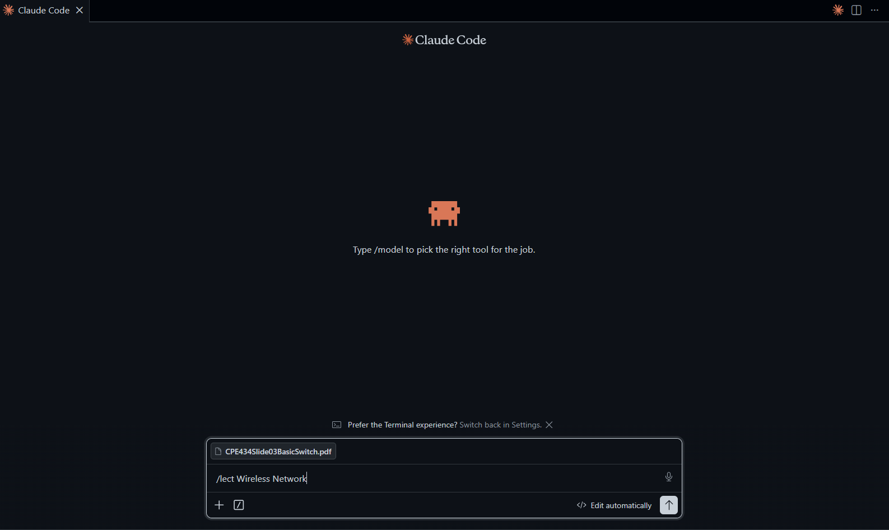
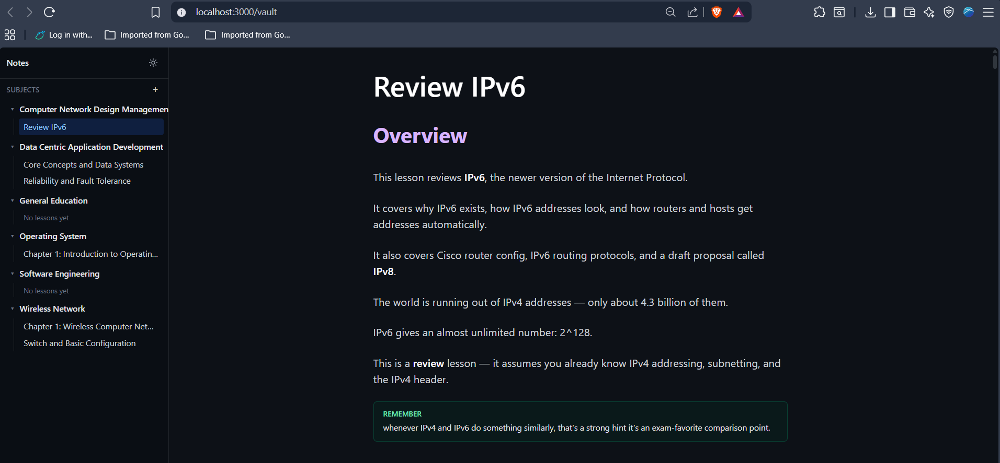

# Notes

This project is a Claude wrapper for explaining lesson files. You hand it a
slide deck, PDF, or image of a topic; it rewrites the content into a plain,
easy-to-read study note — and you read those notes in a clean,
distraction-free web app.

It works for **any subject**. This repo is a template, not tied to one
course or program.

---

## What this is, in plain terms

There are two separate pieces:

1. **The note-writer.** Claude (an AI), run from a terminal command. You
   point it at a slide or PDF, and it writes a full lesson note: explains
   the idea simply, keeps technical terms correct, adds diagrams, examples,
   and common-mistake warnings.
2. **The reader app.** A website you run on your own computer. It only
   shows notes that already exist. It cannot write or change notes itself —
   it's a bookshelf, not an author.

This split is intentional: the website can never produce wrong or rushed
content, because it never generates anything. All the "thinking" happens in
the terminal step, where the note gets reviewed before it's ever saved.

---

## Project flow

1. You run a terminal command, pointing Claude at a slide/file and the
   subject folder it belongs to.
2. Claude reads the file fully and rewrites it as a lesson note — plain
   language, correct terminology, examples, diagrams, common mistakes, exam
   tips.
3. The note is saved to disk, organized under its subject folder.
4. You open the reader app in your browser. The new note appears in the
   sidebar right away, under its subject — click it to read.

There is no "Upload" or "Generate" button inside the website. All note
creation happens in the terminal step, on purpose, so nothing gets written
to your notes by accident while you're just reading.

---

## How to use it — the two commands

Everything in this repo is driven by typing one of two commands at the
start of a request to Claude. Pick the wrong one and Claude will refuse and
point you to the right one — so don't worry about getting it wrong.

### `/lect` — write or update a lesson

Use this when you have a slide/PDF/image and want a note out of it.

1. Open this repo in **Claude Desktop** or the **Claude VS Code extension**.
2. Attach/upload your slide file to the chat.
3. Type `/lect` followed by **only** the folder name, or `folder/filename`
   — nothing else. No extra instructions, no description:
   ```
   /lect Wireless Network
   ```
   or, naming the file explicitly:
   ```
   /lect Wireless Network/Switch and Basic Configuration
   ```
4. Claude converts the file, writes the lesson, validates it, saves it to
   `vault/`, and **opens the reader app in your browser automatically** —
   you don't need to start anything yourself for this path.



### `/feat` — change the app itself

Use this when you want to change the website's UI, fix a bug, or touch any
code under `app/`, `components/`, `lib/`, or `tools/vaultd/`.

1. Same chat, in the same repo.
2. Type a request starting with `/feat`, e.g.:
   ```
   /feat add a delete button next to each lesson in the sidebar
   ```
3. Claude edits the application code only — it will never touch your saved
   lessons under this command.



**Rule of thumb:** lesson content → `/lect`. Anything about the app/website
itself → `/feat`. Never both in the same request.

---

## If the web page doesn't open automatically

`/lect` normally starts both servers and opens your browser for you. If it
doesn't (e.g. you're running the app without going through `/lect`), start
it manually:

```bash
./tools/vaultd/vaultd.exe   # filesystem helper, default :4321
npm run dev                 # http://localhost:3000 -> /vault
```

Run each in its own terminal, then open `http://localhost:3000/vault` in
your browser.

---

## Technical usage

For setup, running the app, and architecture details, see
[SPECIFICATION.md](SPECIFICATION.md).

Quick summary for the technically inclined:

- **Reader app** — Next.js (TypeScript), runs locally with `npm run dev`.
- **Filesystem helper** — a small Go service (`vaultd`) that does plain
  file read/write/list, with zero business logic and no AI calls.
- **Note-writer** — invoked via the [Claude Code](https://claude.com/claude-code)
  CLI's `/lect` command, billed to your Claude subscription, not a
  pay-per-API key.
- **Storage** — each note is an `.html` file plus an `index.json` per
  folder, under `vault/`.

---

## Repo layout

```text
CLAUDE.md            -- repo rules Claude follows (command gatekeeper)
SPECIFICATION.md      -- full architecture (Next.js / Go / Claude split)
flow.md                -- request-by-request data flow (creation/viewing)
.claude/commands/      -- /lect (lesson writing) and /feat (app dev) commands
docs/                  -- detailed rules each command loads
_templates/             -- lesson-template.md, the fixed heading skeleton
scripts/               -- ensure-vaultd, validate-lesson, open-app
app/                   -- Next.js UI + API routes
lib/vault/             -- naming, sanitizing, vaultd client (TypeScript)
tools/vaultd/          -- Go filesystem helper (zero business logic)
vault/                 -- YOUR notes (gitignored, created on first use)
```
