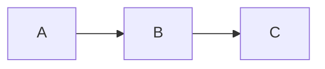

# [Lesson Title]

**Subject:**
**Source file:**
**Date added:**

---

# 📍 Overview

3-5 short sentences, one idea per line.

What this lesson covers.

Why it matters.

What you'll understand by the end.

---

# 🧠 Concept 1: [Concept Name]

(Repeat this whole Concept block for EVERY major idea in the lesson —
one section each, own diagram, never lumped together.)

State the problem this concept solves, before naming the concept.

Explain why that problem actually matters — what breaks without a fix.

Then give the idea in plain English, one sentence per line.

Then the formal **definition**, bolding the term being defined.

Explain any jargon the moment it's used, same line.

> 💡 Key Idea: the one-line core insight of this concept.

---

## ⚙️ How it Works

Step-by-step, one action per line.

1. Step one.

2. Step two.

3. Step three.

Use a table if comparing 2+ things here — never compare in prose.

| Aspect | Option A | Option B |
|---|---|---|
| ... | ... | ... |

---

## 🌍 Example

Everyday/non-technical example first, one sentence per line.

Then the computer/network/math version.

---

## 🖼 Diagram

Explain every arrow right below the diagram, one line per arrow.

---

## ⚠ Common Mistakes

What students often get wrong here.

> ⚠️ Common Mistake: the specific trap, stated plainly.

---

## 🎯 Exam Tips

> 🎯 Exam Tip: a sample question this concept could appear as, with the answer.

---

## 📌 Remember

> 📌 Remember: one memorable takeaway sentence closing out this concept.

---

# 🧠 Concept 2: [Concept Name]

(same structure as Concept 1...)

---

# 📝 Summary

One short line per Concept above — every concept gets a line, none skipped.

Scannable in under a minute before an exam.

---

# 🧠 Self Check

5 questions testing understanding of this lesson's concepts (at least 2
should require connecting two concepts together).

1.

2.

3.

4.

5.
